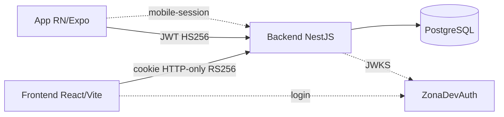
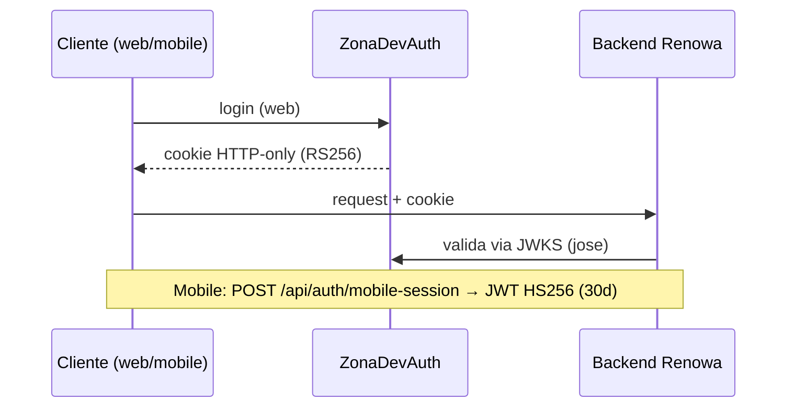
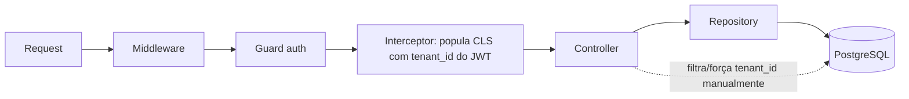
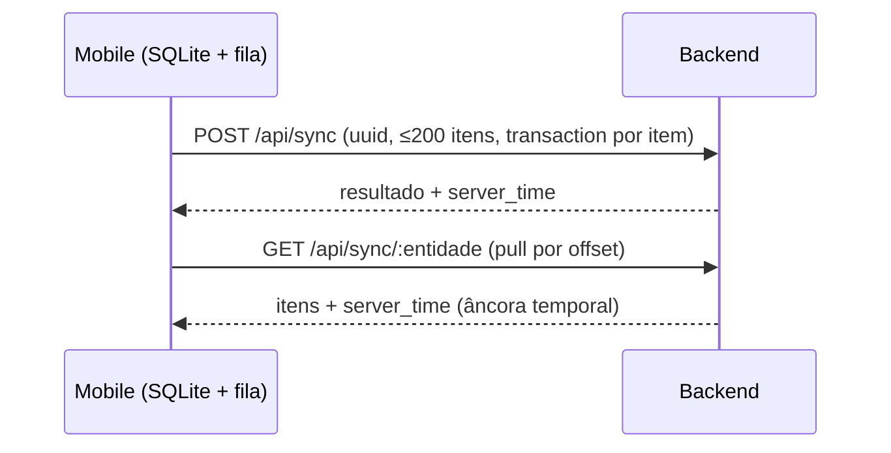

# DIAGRAMS — Renowa

Registro de diagramas do sistema. Mantido pelo `docs-reporter`.

**Status atual:** nenhum arquivo `.drawio` / diagrams.net encontrado no repositório. Não há padrão de diagrama binário estabelecido. Abaixo fica o **plano textual** e as pendências para criação futura dos arquivos. Não inventar `.drawio` complexo sem padrão claro do projeto.

Diagramas textuais usam Mermaid (renderizável no GitHub) como forma inicial versionável.

## 1. Diagrama de arquitetura (sugerido)

## 2. Fluxo de autenticação (sugerido)

## 3. Fluxo multi-tenant (sugerido)

> **Ressalva (auditoria 2026-07-08):** o `tenant.subscriber` **não está registrado/ativo** — a etapa "subscriber injeta tenant_id no INSERT" que aparecia neste diagrama **não acontece**. O isolamento hoje depende de cada service passar `tenant_id` de `user.tenantId` manualmente. Ver [PROB-0016](PROBLEM_LEDGER.md). Sync usa `INSERT` cru (nunca passaria por subscriber TypeORM de qualquer forma).

## 4. Ciclo de sync offline (sugerido)

## 5. Diagrama de módulos (sugerido)

- **backend:** `auth`, `sync`, domínio (usuários/clientes/fornecedores/pedidos/produtos), `finance` (movimentações/comissões/parceiros/dashboard), `faturamento` (novo, 2026-07-22 — notas fiscais), `consultas` (novo, 2026-07-22 — CNPJ via BrasilAPI), `common` (interceptor/subscriber/base.entity). Ver [SYSTEM_OVERVIEW.md](SYSTEM_OVERVIEW.md) para o ciclo comercial completo (pedidos → faturamento → comissão → caixa).
- **frontend:** rotas → AppShell → Sidebar; store auth; camada de serviço axios.
- **mobile:** App → SyncService → ApiService → sync-queue (SQLite) → database.

## Pendências para arquivos `.drawio` futuros

- [ ] Definir se o projeto adota diagrams.net (`.drawio`) ou mantém Mermaid versionado.
- [ ] Exportar arquitetura (item 1) para `.drawio` se adotado.
- [ ] Exportar fluxo de auth (item 2).
- [ ] Exportar fluxo multi-tenant (item 3).
- [ ] Manter os diagramas em sincronia com `SYSTEM_OVERVIEW.md` a cada mudança estrutural.
